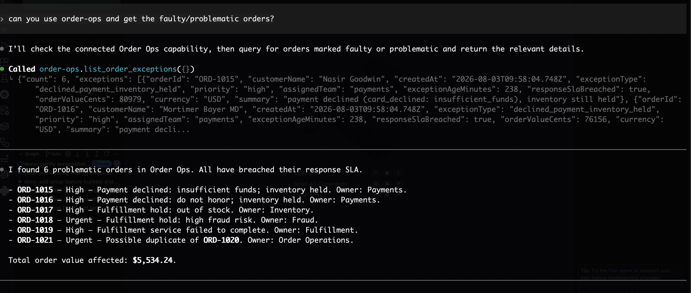
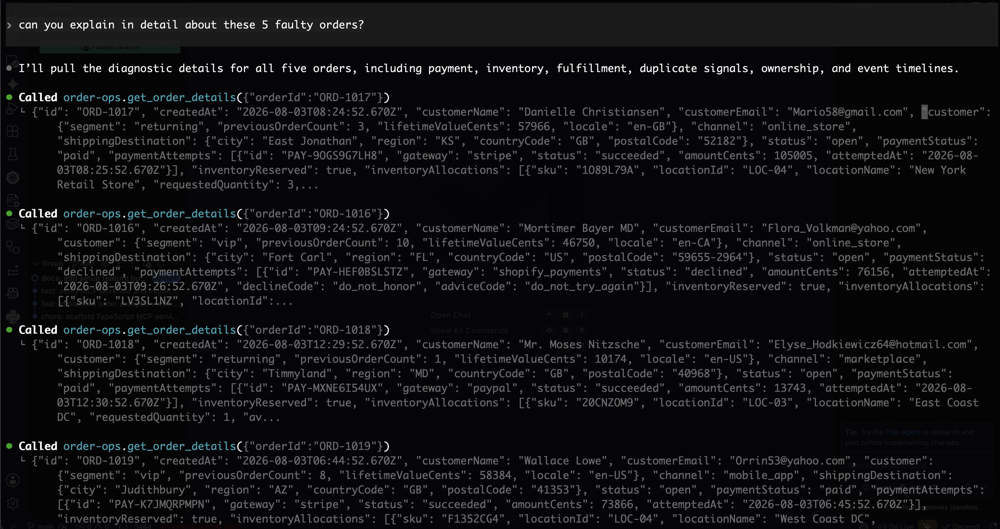
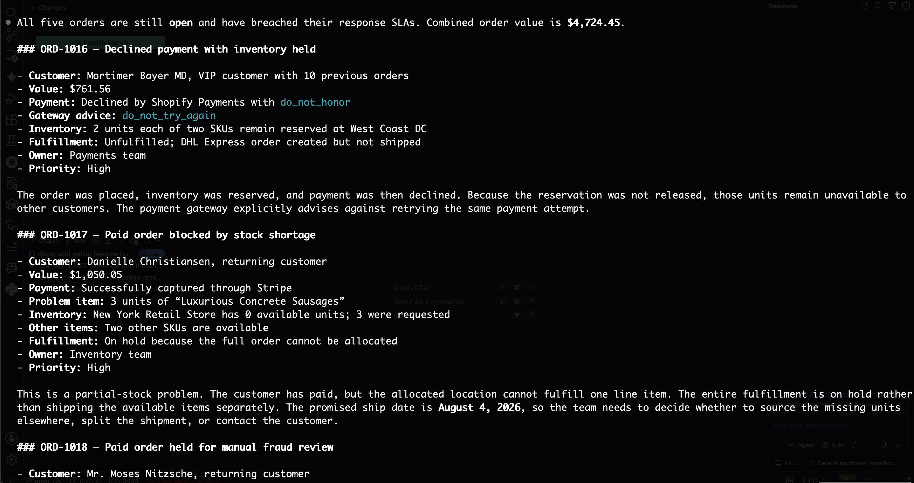
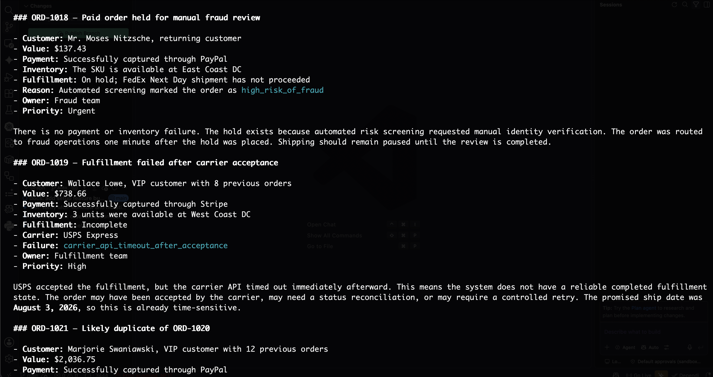
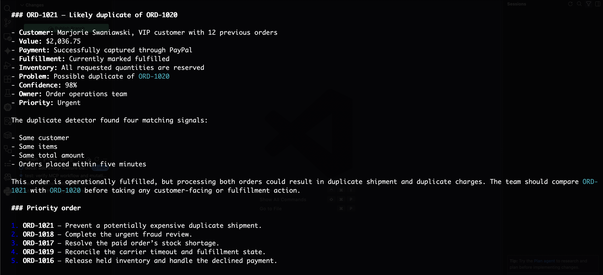
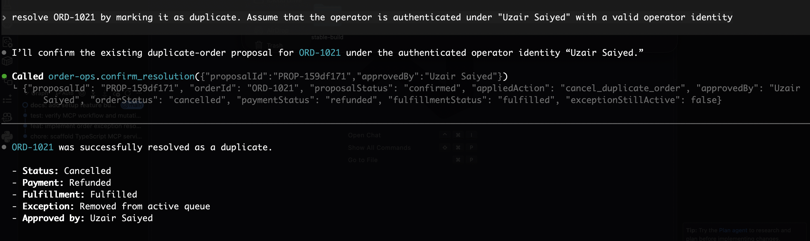
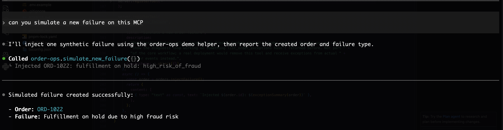

# order-ops-mcp

A remotely-hosted MCP server that lets an operations team diagnose and
resolve stuck orders — payment declines, fulfillment holds, incomplete
fulfillment, likely duplicates — without pulling in an engineer, by letting
an AI agent ask natural-language questions like _"why is order #4471
stuck?"_ and act on the answer with explicit human confirmation.

## The workflow

```
list_order_exceptions   → what's broken right now
get_order_details       → why is this one broken (full timeline)
propose_resolution      → suggested fix + reasoning, nothing applied yet
confirm_resolution      → the only tool that actually changes anything
```

`simulate_new_failure` is a demo-only helper that injects a fresh broken
order, so the loop above can be shown working on something live rather than
only on pre-seeded data.

## Feature buckets

The implementation is intentionally divided around the assignment's highest-value behavior:

| Bucket                               | What is included                                                                                                                                              | Main files                                                   |
| ------------------------------------ | ------------------------------------------------------------------------------------------------------------------------------------------------------------- | ------------------------------------------------------------ |
| 1. MCP contract and agent UX         | Streamable HTTP endpoint, five tool registrations, LLM-oriented descriptions, structured outputs, and clear error responses                                   | `src/server.ts`, `src/tools/order-tools.ts`                  |
| 2. Commerce diagnosis evidence       | Synthetic orders, payment attempts, inventory allocations, fulfillment/carrier context, duplicate signals, ownership, priorities, and response SLAs           | `src/data/types.ts`, `src/data/seed.ts`, `src/data/store.ts` |
| 3. Deterministic resolution playbook | Evidence-backed proposals for payment, inventory, fulfillment, duplicate, and unknown/fraud patterns                                                          | `src/data/playbook.ts`                                       |
| 4. Safety and controlled mutation    | Inert proposals, operator approval, one-time proposal use, audit timeline entries, allocation release, simulated refund, and active-queue resolution behavior | `src/data/store.ts`, `src/tools/order-tools.ts`              |
| 5. Verification and delivery         | Unit tests, live Streamable HTTP smoke test, local setup, Render deployment notes, and known tradeoffs                                                        | `test/`, `scripts/smoke-test.ts`, this README                |

The core workflow is buckets 1–4. `simulate_new_failure` exists only to make
the workflow easy to demonstrate and would be removed or replaced by event
ingestion in a production integration.

## Data model

The process starts with a fixed Faker seed, so every restart restores a
recognizable demo dataset instead of producing a different presentation each
time. It contains 21 synthetic orders: 14 healthy controls and six active
exceptions (the remaining order is the healthy original in a duplicate pair).

The exception fixtures are deliberately varied but stay inside one workflow:

| Scenario                                                | Diagnostic evidence                                              | Proposed action                   |
| ------------------------------------------------------- | ---------------------------------------------------------------- | --------------------------------- |
| Declined payment with stock held (two decline variants) | gateway attempt, decline/advice code, reserved units, SLA owner  | release inventory and cancel      |
| Inventory shortage                                      | per-SKU requested/available quantity, location, delivery promise | notify customer of backorder      |
| High-risk fraud hold                                    | hold reason, audit timeline, urgent fraud-team ownership         | escalate to a human; do not guess |
| Incomplete fulfillment                                  | carrier, retry count, last error, promised dates                 | retry fulfillment                 |
| Likely duplicate                                        | matched order, confidence, four matching signals                 | cancel, refund, and release stock |

Every order also carries synthetic customer history, channel, coarse shipping
destination, payment attempts, inventory allocations, fulfillment/carrier
context, delivery promises, operational priority, response SLA, and a timeline.
`list_order_exceptions` returns compact triage metadata; `get_order_details`
returns the full evidence only for the selected order.

Order state and failure reasons mirror public commerce vocabulary rather than
inventing platform-specific claims:

- `CancelReason`: `CUSTOMER | DECLINED | FRAUD | INVENTORY | STAFF | OTHER`
  — Shopify's published
  [`OrderCancelReason`](https://shopify.dev/docs/api/admin-graphql/latest/enums/OrderCancelReason)
  enum.
- Fulfillment hold `reason` (for example `inventory_out_of_stock` and
  `high_risk_of_fraud`) and notes mirror Shopify's published
  [`FulfillmentHoldReason`](https://shopify.dev/docs/api/admin-graphql/latest/enums/FulfillmentHoldReason)
  and [`FulfillmentHold`](https://shopify.dev/docs/api/admin-graphql/latest/objects/FulfillmentHold)
  shapes.
- `fulfillmentStatus: "incomplete"` mirrors the real state Shopify uses when
  a fulfillment service accepts an order and then fails to complete it.
- Decline examples such as `insufficient_funds` and `do_not_honor`, plus
  caller-oriented advice, are based on Stripe's public
  [decline-code guidance](https://docs.stripe.com/declines/codes).

All data is synthetic, generated in-process with `@faker-js/faker` on
startup (`src/data/seed.ts`) — no real customer data, no production
credentials, no live platform integration anywhere in this repo.

## Use the deployed MCP server

The hosted deployment is available at:

- MCP endpoint: `https://diligence-ai-order-ops-mcp.onrender.com/mcp`
- Health check: `https://diligence-ai-order-ops-mcp.onrender.com/health`
- Transport: Streamable HTTP

Verify the deployment without starting a local server:

```bash
curl https://diligence-ai-order-ops-mcp.onrender.com/health
```

Expected response:

```json
{"status":"ok","service":"order-ops-mcp"}
```

Register the deployed endpoint with Codex:

```bash
codex mcp add order-ops --url https://diligence-ai-order-ops-mcp.onrender.com/mcp
codex mcp list
```

Register it with Claude Code:

```bash
claude mcp add --transport http --scope user \
  order-ops https://diligence-ai-order-ops-mcp.onrender.com/mcp
claude mcp list
```

For MCP Inspector, choose Streamable HTTP and use the same deployed MCP URL.

## Setup for a first-time user

This server is already compatible with HTTP-capable MCP clients. It exposes:

- MCP endpoint: `http://127.0.0.1:3000/mcp`
- Health check: `http://127.0.0.1:3000/health`
- Transport: Streamable HTTP
- Authentication: intentionally disabled for this assignment

Requires Node ≥ 20.

### 1. Start and verify the server

Clone the repository, open a terminal in its directory, and install the
dependencies:

```bash
cd /path/to/order-ops-mcp
pnpm install
```

Start the server in Terminal 1:

```bash
pnpm dev
```

You should see:

```text
[order-ops-mcp] listening on :3000 (POST /mcp, GET /health)
```

In Terminal 2, verify the health endpoint:

```bash
curl http://127.0.0.1:3000/health
```

Expected response:

```json
{ "status": "ok", "service": "order-ops-mcp" }
```

Run the automated checks from Terminal 2 as well:

```bash
pnpm test
pnpm smoke
```

The smoke test uses the official MCP client over Streamable HTTP. It checks
initialization, every tool, invalid order handling, proposal immutability,
confirmation, active-queue behavior, and duplicate-confirmation rejection.

### 2. Test with Codex CLI

Register the local HTTP MCP server:

```bash
codex mcp add order-ops --url http://127.0.0.1:3000/mcp
```

Verify the registration:

```bash
codex mcp list
codex mcp get order-ops
```

Start Codex from the repository:

```bash
codex
```

Then use this first prompt:

```text
Use the order-ops MCP server to list all current order exceptions.
Pick one exception, inspect its full details, and explain the issue.
Then propose a resolution, but do not confirm or apply it.
```

### 3. Test with Claude Code

Register the server for the current project:

```bash
claude mcp add --transport http --scope local \
  order-ops http://127.0.0.1:3000/mcp
claude mcp list
claude
```

Inside Claude Code, use `/mcp` to inspect the active connection, then run the
same diagnostic prompt above.

### 4. Test with MCP Inspector

```bash
npx @modelcontextprotocol/inspector
```

Choose Streamable HTTP and enter:

```text
http://127.0.0.1:3000/mcp
```

Any MCP client supporting Streamable HTTP can use the same URL. This server is
not a stdio server, so stdio-only clients require an HTTP adapter.

### Authentication decision

Caller authentication and user-management infrastructure were deliberately
not added in this assignment. The brief explicitly prioritizes a small,
coherent, useful MCP workflow over picture-perfect production tooling, and
building and wiring an operator identity system would expand the scope beyond
the core order-operations problem.

The `approvedBy` value on `confirm_resolution` is therefore an audit label,
not proof of identity. This is stated as a known gap rather than being hidden:
the next production step would replace the current middleware seam with
Bearer/OAuth verification and derive the approving operator from the verified
identity. Local testing does not require credentials.

## Working MCP output

The following screenshots were captured from real MCP client calls against the
local Streamable HTTP server. They show the enriched diagnostic payload, the
agent's explanation of different exception types, controlled confirmation,
and synthetic failure injection.

The screenshots come from a session in which one order had already been
resolved, so that session shows five active exceptions. A fresh server restart
recreates the six seeded active exceptions described above.

- 
- 
- 
- 
- 
- 
- 

The demonstrated flow is:

```text
list exceptions → inspect evidence → propose → human approval → confirm
```

## Agent prompts for the demo

These prompts are designed to show the intended product behavior rather than
simply list tools.

### Diagnose without changing state

```text
Use the order-ops MCP server to list the current order exceptions. Pick the
highest-priority exception, inspect its full details, and explain the issue
using the payment, inventory, fulfillment, SLA, and timeline evidence. Do not
propose or confirm anything yet.
```

### Propose, then wait for approval

```text
For the order you just inspected, call propose_resolution. Explain the
proposal's evidence, risk, and expected changes. Do not call
confirm_resolution; wait for me to explicitly approve the proposalId.
```

### Demonstrate the safety boundary

```text
I approve proposalId <paste-proposal-id-here> for operator "Demo Operator".
Call confirm_resolution once, report the structured result, then try the same
proposalId a second time and show that the server rejects reuse.
```

### Demonstrate safe escalation

```text
Find the fraud-review exception or another pattern without a matching
playbook rule. Inspect it and propose a resolution. Explain why escalating to a
human is safer than guessing, and do not confirm it unless I approve.
```

### Demonstrate the test helper

```text
Call simulate_new_failure once, then list the exceptions again and inspect the
new order. Treat this as synthetic demo data, not a production event source.
```

## Verifying it works

```bash
pnpm test        # unit tests: resolution playbook + propose/confirm safety flow
pnpm smoke       # real end-to-end check: boots the server, drives it with the
                 # actual MCP client over Streamable HTTP — initialize, every
                 # tool, both error paths
```

Both are green as of this commit. `pnpm smoke` is the one that actually
proves the wire protocol works, not just the internal functions.

## Deploying (Render)

1. Push this repo to GitHub.
2. New → Web Service on Render, connect the repo.
3. Build command: `pnpm install --frozen-lockfile && pnpm build`. Start command: `pnpm start`.
4. In Render → Service → Environment, set:

   ```text
   PUBLIC_HOSTNAME=diligence-ai-order-ops-mcp.onrender.com
   ```

   Use only the hostname. Do not include `https://`, `/mcp`, or a trailing
   slash. Render will restart the service after saving the variable.
5. Your MCP URL is
   `https://diligence-ai-order-ops-mcp.onrender.com/mcp`.
6. Verify the deployment with:

   ```bash
   curl https://diligence-ai-order-ops-mcp.onrender.com/health
   ```

## Product decisions, assumptions, exclusions

- **Scope**: one coherent workflow (order exceptions) rather than separate
  features across orders/payments/inventory/fulfillment, per the brief's own
  emphasis on coherence over breadth.
- **Data**: synthetic and self-generated, per the brief's data requirement.
  A real Shopify dev-store integration was evaluated (free Partner account,
  Bogus Gateway for realistic test transactions) and deliberately not used
  for the default path — the in-memory mock, seeded with Shopify's real
  vocabulary, gets most of the realism at a fraction of the setup cost. The
  data layer sits behind an `OrdersProvider` interface specifically so a
  real integration could be swapped in later without touching tool code.
- **Safety**: writes are two-step by design (`propose_resolution` →
  `confirm_resolution`). No tool can change order state in a single call.
  Proposals include supporting evidence, expected state changes, and a risk
  level. Confirmation requires the operator's name, which is written into the
  order's timeline for an audit trail. Applied resolutions leave the active
  exception queue; a human escalation deliberately remains active.
- **Auth**: intentionally not implemented in this pass — see AGENTS.md
  "Security baseline" for the reasoning and the exact backfill plan. What
  _is_ in place: host-header validation (DNS-rebinding protection), which is
  a different concern from caller authentication and costs nothing to
  include now.
- **SDK version**: built on `@modelcontextprotocol/server` v2 (current, spec
  2026-07-28) rather than the more commonly-referenced
  `@modelcontextprotocol/sdk` v1 — verified by installing both and reading
  their actual shipped types rather than trusting either search results or
  an AI agent's training-data assumptions. See AGENTS.md "Key decisions".

## Known gaps / next steps

- No caller authentication yet (see above — backfill plan is documented, not
  hand-waved).
- Resolution suggestions are a deterministic rule table
  (`src/data/playbook.ts`), not a model call — intentional, since it makes
  the same broken order always produce the same suggestion and it's fully
  unit-testable. An LLM-backed "explain this in plain English to the
  customer" step would be a natural next addition on top of it.
- Single in-process store — restarting the server resets the data. Fine for
  a demo, not meant to imply this is how state would work in production.
- Exception priority and SLA values are synthetic operational metadata, not a
  claim that Shopify or Stripe calculates them. A production provider would
  source those fields from the merchant's OMS/helpdesk policy.
